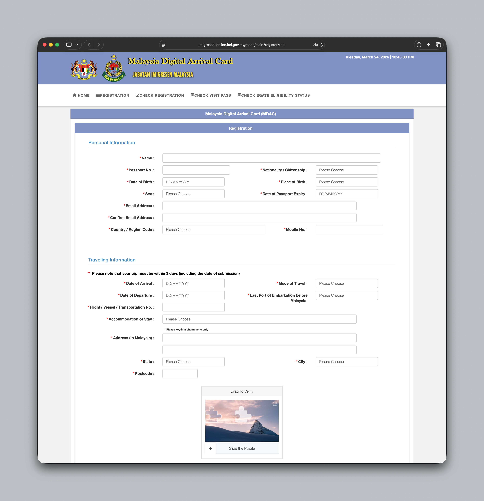
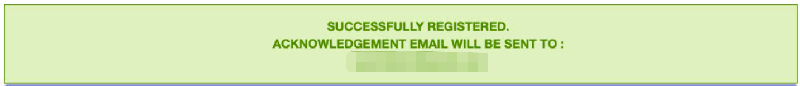

# 🦞 mdac-filler

**Auto-fill Malaysia Digital Arrival Card (MDAC) — powered by AI**

> 🌐 [English](#english) | [中文](#chinese)

---

<a name="english"></a>
## 🇬🇧 English

### The Problem

Every trip from Singapore to Johor Bahru requires filling in the Malaysia Digital Arrival Card (MDAC) manually:

- Fill in name, passport number, nationality, date of birth, place of birth…
- Select entry mode, travel dates, transportation…
- Enter Malaysia accommodation address, state, city, postcode…

The whole process is tedious and repetitive — takes 5–10 minutes every time.

### The Solution

With **mdac-filler**, just tell your AI assistant your travel details. Everything else is handled automatically:

- ✅ Opens the MDAC website automatically
- ✅ Fills in all form fields
- ✅ Solves the slider CAPTCHA
- ✅ Submits the form — confirmation email sent to your inbox

### Example

**You tell 🦞:**

> Fill in my Malaysia arrival card.
> Name: ZHANG SAN, Passport: A12345678
> Arrival: 25/03/2026, same-day return
> Land entry from Singapore via Bus 170, destination Johor Bahru City Square

**Form being filled:**



**A moment later, 🦞 replies:**

> ✅ MDAC successfully submitted!
>
> SUCCESSFULLY REGISTERED
> Confirmation email sent to: your@email.com



### How It Works

1. **Playwright browser automation** — launches a real (non-headless) browser for full compatibility
2. **JS injection** — fills all form fields via `document.getElementById`
3. **CAPTCHA solver** — analyzes `longbow.slidercaptcha.js` to locate the gap:
   - Patches `$.ajax` to handle the `/captcha` verification response
   - Reads real gap coordinate from `instance.x` on the slidercaptcha instance
   - Calculates exact drag distance and simulates human-like mouse movement
4. **Auto-submit** — clicks Submit and waits for the success page

### Installation

```bash
pip install playwright
playwright install chromium

git clone https://github.com/YangXinlin/mdac-filler
cd mdac-filler

python3 scripts/fill_and_submit.py --data '{
  "name": "ZHANG SAN",
  "passNo": "A12345678",
  "nationality": "CHN",
  "pob": "CHN",
  "dob": "01/01/1990",
  "sex": "2",
  "passExpDte": "01/01/2035",
  "email": "your@email.com",
  "confirmEmail": "your@email.com",
  "region": "65",
  "mobile": "91234567",
  "arrDt": "25/03/2026",
  "trvlMode": "2",
  "depDt": "25/03/2026",
  "embark": "SGP",
  "vesselNm": "Bus 170",
  "accommodationStay": "99",
  "accommodationAddress1": "106-108, Jalan Wong Ah Fook, Bandar Johor Bahru, 80000 Johor Bahru, Johor",
  "accommodationAddress2": "Johor Bahru City Square",
  "accommodationState": "01",
  "accommodationCity": "0118",
  "accommodationPostcode": "80250"
}'
```

Or use a JSON file:

```bash
python3 scripts/fill_and_submit.py --file my_info.json
```

### Security

- **Use `--file` instead of `--data`** — command-line arguments are visible in process lists and shell history. Store your passport info in a local JSON file with restricted permissions:
  ```bash
  chmod 600 my_info.json
  ```
- Your data is only sent to the official MDAC website. No third-party services are involved.

### Notes

- MDAC must be submitted within **3 days before arrival**
- **Singapore citizens are exempt**
- Each traveler needs a separate submission (including children)
- Free, no account required

### OpenClaw Skill

This project is also an [OpenClaw](https://openclaw.ai) AgentSkill, installable via [ClawHub](https://clawhub.com).

---

<a name="chinese"></a>
## 🇨🇳 中文

### 痛点

每次从新加坡去新山，都要手动打开马来西亚入境卡网站：

- 一个个填写姓名、护照号、国籍、出生日期、出生地……
- 选择入境方式、日期、交通工具……
- 填写马来西亚住宿地址、州份、城市、邮编……

整个流程繁琐、重复，每次出行前都得花 5-10 分钟。

### 解决方案

有了 **mdac-filler skill**，只需要告诉 AI 你的出行信息，剩下的全部自动完成：

- ✅ 自动打开 MDAC 官网
- ✅ 自动填写所有表单字段
- ✅ 自动破解拼图滑块验证码
- ✅ 自动提交，确认邮件发到你的邮箱

### 使用场景

**你对 🦞 说：**

> 帮我填写马来西亚入境卡
> 姓名：ZHANG SAN，护照：A12345678
> 入境日期：25/03/2026，当天往返
> 从新加坡乘坐 Bus 170 陆路入境，目的地新山城市广场

**填写中的表单：**


**过一会儿，🦞 回复：**

> ✅ MDAC 已成功提交！
>
> 注册成功：SUCCESSFULLY REGISTERED
> 确认邮件发至：your@email.com

**成功截图：**


### 技术原理

1. **Playwright 浏览器自动化** — 打开真实浏览器（非 headless），绕过反机器人检测
2. **JS 注入填表** — 通过 `document.getElementById` 批量填写所有字段
3. **CAPTCHA 自动处理** — 分析 `longbow.slidercaptcha.js` 定位缺口坐标：
   - 处理 `/captcha` 服务端验证响应
   - 读取验证码实例的真实缺口坐标 `instance.x`
   - 精确计算滑块移动距离并模拟人类拖动轨迹
4. **自动提交** — 点击 Submit 按钮，等待成功页面

### 安装使用

```bash
# 安装依赖
pip install playwright
playwright install chromium

# 克隆
git clone https://github.com/YangXinlin/mdac-filler
cd mdac-filler

# 运行
python3 scripts/fill_and_submit.py --file my_info.json
```

### 字段说明

详见 [`references/field-values.md`](references/field-values.md)，包含：

- 国籍/出生地代码（CHN、SGP 等）
- 入境方式（陆路/空路/海路）
- 柔佛州各城市代码

### 安全提示

- **推荐用 `--file` 而非 `--data`** — 命令行参数会出现在进程列表和 shell 历史里，护照信息不应直接写在命令行中。将信息存入本地 JSON 文件并限制权限：
  ```bash
  chmod 600 my_info.json
  ```
- 数据只发送到 MDAC 官方网站，不涉及任何第三方服务。

### 注意事项

- MDAC 须在**入境前 3 天内**提交
- **新加坡公民免填**
- 每位旅客需单独提交（包括儿童）
- 免费，无需注册账号

### OpenClaw Skill

本项目也是一个 [OpenClaw](https://openclaw.ai) AgentSkill，可通过 [ClawHub](https://clawhub.com) 安装到你的 AI 助手中。
